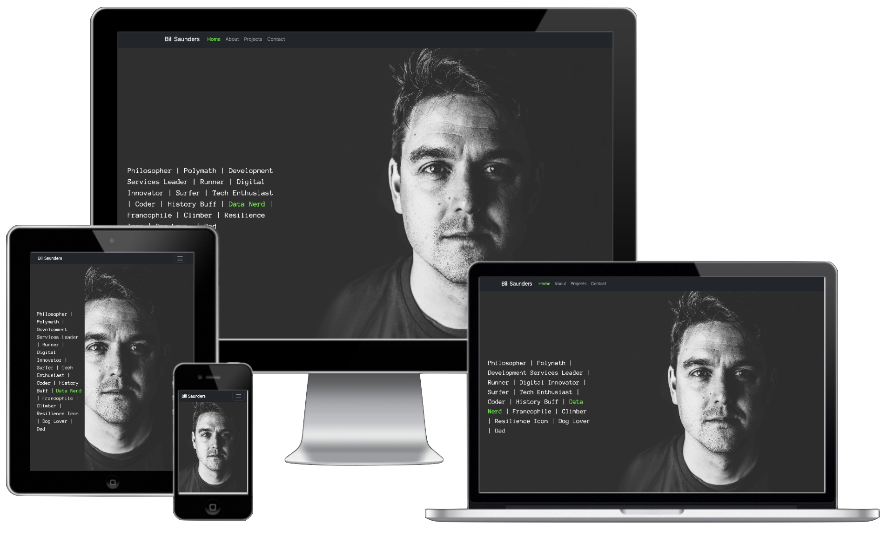

# Bill Saunders: Personal Portfolio Site
Link to live project: https://bizboz1981.github.io/PersonalPortfolioSite/index.html

## Table of Contents
[User Experience (UX)](#user-experience-ux)  
[Features](#features)  
[Design](#design)  
[Technologies Used](#technologies-used)  
[Testing](#testing)  
[Deployment](#deployment)  
[Credits](#credits)  

# User Experience (UX)
## User Stories
### First Time Visitor Goals
<ol>
<li>As a First Time Visitor, I want to easily understand the main purpose of the site and learn more about the skills, interests and ethos of Bill.</li>
<li>As a First Time Visitor, I want to be able to easily navigate throughout the site to find coding projects and to be inspired about software and web development.</li>
<li>As a First Time Visitor, I want to find and use a simple contact form and social media links to get in touch with Bill.</li>
</ol>

### Returning Visitor Goals
<ol>
<li>As a Returning Visitor, I want to be able to view the new projects Bill has linked from GitHub.</li>
<li>As a Returning Visitor, I'm interested in learning about any new skills or technologies Bill has acquired, which could inspire my own learning paths or professional development.</li>
<li>As a Returning Visitor, I want to be able to contact Bill to explore opportunities for collaboration to give feedback or ask questions.</li>
</ol>

### Frequent Visitor Goals
<ol>
<li>As a Frequent Visitor, I want to see the latest projects Bill has worked on, including any updates to existing projects, to understand his current focus and skills development.</li>
<li>As a Frequent Visitor, I'm interested in Bill's career advancements, such as new roles, responsibilities, achievements, or changes in his professional direction.</li>
<li>As a Frequent Visitor, I look forward to reading Bill's latest blog posts or articles that share insights into his field of expertise, reflect on industry trends, or provide valuable advice to others in the profession.</li>
</ol>

# Features & Structure
## Existing Features
### Site-Level Elements
##### <u>Navbar</u>
This is a [bootstrap](https://getbootstrap.com) navbar that is fixed to the top of the page. It contains links to the Home, About, Projects and Contact sections of the site. The navbar is responsive and collapses to a hamburger menu on smaller screens.
##### <u>Social Media Links</u>
These are located in the footer of the site and are represented by the social media icons for LinkedIn, GitHub, Instagram and Twitter. They are links to Bill's profiles on these platforms.
##### <u>Footer</u>
The footer uses bootstrap classes and the code was sourced from [mdbootstrap](https://mdbootstrap.com/docs/standard/navigation/footer/)
### Page-Level Elements
#### Home
The home page is all about getting a sense of who Bill is. The feel of the site is clean and slick, with a modern, techy feel. The colour scheme is grey with a the odd pop of lime green and hot pink.
##### <u>Hero Image</u>
This is a full-width image of Bill Saunders, the site owner, and is the first thing the user sees when they visit the site. It is designed to be eye-catching and to give the user a sense of who Bill is and what he does.
##### <u>Buzz Words</u>
Catchy phrases that describe Bill's skills and interests. These are designed to be impactful and to reinforce the user's sense of what Bill is about. A pop of lime green is used to make one of the buzz words stand out.
##### <u>All about Bill</u>
This is essentially a personal statement written in a distinctive and personal style, rather than a dry, corporate bio. It is designed to be engaging and to give the user a sense of Bill's personality and ethos.

#### About
The branding on the About page is consistent with the homepage. The page is designed to give the user more detail Bill's background and career journey. There is no hero image on this page - the visuals do the work instead.
##### <u>Timeline</u>
This is a timeline of Bill's career, with key events and achievements. It is designed to be easy to read and to give the user a sense of Bill's career journey. The template code was sourced from a [Code Institute lesson](https://github.com/Code-Institute-Solutions/resume-miniproject-bootstrap4/) and 'translated' to Bootstrap 5 and customised to suit the site's design.
##### <u>Skills & Competencies</u>
This provides some more detail on the programming languages, technologies and tools that Bill is skilled in. The progress bars were inspired by [Matt Rudge](https://github.com/lechien73)'s lesson on building a [resume page](https://github.com/Code-Institute-Solutions/resume-miniproject-bootstrap4/) in the Code Institute course. However, the code was taken from [Bootstrap 5](https://getbootstrap.com/docs/5.3/components/progress/) and customised with custom css.
#### Projects
This is a list of Bill's favourite project on GitHub. The look and feel of the site is on-brand, consisting on mainly grey with pops of lime green and hot pink. The hero image on this page was generated by AI ([DALL-E](https://openai.com/dall-e-3)) and is designed to be eye-catching and to give the user a sense of what the page is about.

#### Contact
This is a simple contact form that allows the user to get in touch with Bill. The branding is consistent with the rest of the site. The form is designed to be simple and easy to use, with a clean, modern feel. The form is very basic HTML but uses [Bootstrap 5](https://getbootstrap.com) classes for style and format.

## Future Features
<ul>
    <li>I will leverage JavaScript to programmatically interact with  <a href="https://docs.github.com/en/rest/using-the-rest-api/getting-started-with-the-rest-api?apiVersion=2022-11-28">GitHub's API</a>, enabling the automatic population and updating of the list showcasing my most recently starred repositories.</li>
    <li>I will use JavaScript to randomly highlight individual 'Buzz Words' in lime green for a few seconds.</li>
    <li>I will use JavaScript to recreate the parallax effect, as this is not supported in css in mobile browsers I tested (apparently due the the <a href="https://forums.developer.apple.com/forums/thread/99883">high repaint cost</a>).</li>
    <li>I will, in due course, deploy to a custom URL.</li>
</ul>

# Design
## Colour Scheme
The colour scheme uses a lot of grey. The main colour "brand-dark-gray" (#2f2f2f) was sampled from the hero image on the home page. The inspiration of pairing this with the secondary brand colour green ("brand-lime": #00ff00) and the tertiary pink ("brand-pink": #ff00ff) was taken from <a href="https://www.schemecolor.com/pink-grey-green.php">here</a>. Contrast was checked for accessibility using <a href="https://webaim.org/resources/contrastchecker/">WebAIM's contrast checker</a>. The green and pink are used sparingly to add a pop of colour and to make the site feel modern and fresh. The green is used for the navbar, the hero image on the home page, the 'Buzz Words' on the home page, the progress bars on the About page and the 'Send' button on the Contact page. The pink is used for the 'Buzz Word' on the home page and the 'Send' button on the Contact page. The grey is used for the background of the site and the text. The white is used for the text and the progress bars on the About page.

# Technologies Used
## Languages
<ul>
    <li>HTML5</li>
    <li>CSS3</li>
    <li>Mardown</li>
</ul>

## Applications
<ul>
    <li><a href="https://git-scm.com">Git</a> - for version control</li>
    <li><a href="https://github.com">GitHub</a> - for version control and website hosting</li>
    <li><a href="https://code.visualstudio.com">Visual Studio Code</a> - for coding the project and managing the files</li>
    <li><a href="https://www.adobe.com/uk/products/photoshop.html">Adobe Photoshop</a> - for photo editing</li>
    <li><a href="https://openai.com/dall-e-3">OpenAI's DALL-E</a> - for image generation</li>
    <li><a href="https://convertio.co/">Convertio</a> - for converting images to webp format</li>
</ul>

## Frameworks, Libraries & CDNs
<ul>
    <li><a href="https://fonts.google.com/">Google Fonts</a> - 'Exo' is used for headings for its simple, modern look and the monospade 'Anonymous Pro' is used for body text for it's 'codey' feel.</li>
    <li><a href="https://fontawesome.com/">Font Awesome</a> - Font Awesome is used for social media icons.</li>
    <li><a href="https://getbootstrap.com">Bootstrap 5</a> - Bootstrap 5 is used extensively througout the project for responsiveness and for providing template code for several elements. However, all Bootstrap elements are styled with custom css.</li>
</ul>

## Other Tech & VS Code Extensions
<ul>
    <li><a href="https://github.com/features/copilot">GitHub CoPilot</a> - I used this for checking code, troubleshooting and debugging - <u>not for writing code.</u></li>
    <li><a href="https://code.visualstudio.com/docs/editor/emmet">Emmet</a> - for boilerplate html and shortcuts.</li>
    <li><a href="https://marketplace.visualstudio.com/items?itemName=biomejs.biome">Biome</a> - for code formatting and code completion ('intellisense').</li>
</ul>

## Learning Resources
I have credited specific resources throughout the code, but during my learning journey I have used the following resources extensively and my whole project has been inspired by elements of them all:
<ul>
    <li><a href="http://chat.openai.com">Chat GPT</a> - I have used Chat GPT to explain concepts to me, and to help me use VS Code and the terminal more efficiently. I have also used it to explain code snippets from other sources in greater detail. <u>I have specifically not used Chat GPT to write code for me.</u> All source code in the project is credited where approrpriate.</li>
    <li><a href="https://www.w3schools.com">W3 Schools</a> - used extensively for inspiration, problem solving and occasionally for template code.</li>
    <li><a href="https://stackoverflow.com">Stack Overflow</a> - primarily for troubleshooting issues</li>    
    <li><a href="https://www.codecademy.com">Codecademy</a> - as a user of Codecademy for a number of years, I must credit this site for any background knowledge I may have had.</li>cha
</ul>

# Testing
## User Stories

## Manual Testing
### Features Testing
| Feature                | Test Case                                     | Outcome                                                       |
| ---------------------- | --------------------------------------------- | ------------------------------------------------------------- |
| Logo                   | Click on the Logo                             | User taken to homepage                                        |
| Navbar > Homepage      | Click the Home link on each page              | User brought to homepage successfully                         |
| Navbar > About Page    | Click the About link on each page             | User brought to About page successfully                       |
| Navbar > Projects Page | Click the Projects link on each page          | User brought to Projects page successfully                    |
| Navbar > Contact Page  | Click the Contact link on each page           | User brought to Contact page successfully                     |
| Social Media Links     | Click on each social media icon in the footer | User taken to the relevant social media page                  |
| Contact Form           | Fill in the form and click 'Send'             | Form data is sent to the correct server and confirmed to user |

### Device & Browser Responsiveness Testing

| Device/Browser        | Appearance | Responsiveness | Issues                        |
| --------------------- | ---------- | -------------- | ----------------------------- |
| iPad Air/Safari       | Good       | Good           | None                          |
| iPhone 14 Pro/Safari  | Good       | Good           | Parallax effect not supported |
| iPhone 14 Pro/Firefox | Good       | Good           | Parallax effect not supported |
| iPhone 14 Pro/Chrome  | Good       | Good           | Parallax effect not supported |
| Macbook Air/Safari    | Good       | Good           | None                          |
| Macbook Air/Chrome    | Good       | Good           | None                          |
| Macbook Air/Firefox   | Good       | Good           | None                          |
| Windows 10/Chrome     | Good       | Good           | None                          |
| Windows 10/Firefox    | Good       | Good           | None                          |
| Windows 10/Edge       | Good       | Good           | None                          |

In addition to the above, I have tested extensively in the Chrome DevTools device emulator and have tested the site on a number of other devices and browsers. The site is fully responsive and works well on all devices and browsers I have tested. The only issues I encountered were with the parallax effect, which is not supported on my iPhone 14 Pro, and I will need to address this in future updates with JavaScript. To solve the issue for now, I have set `background-attachment: scroll` in the media query for mobile devices.

I used the following media queries to ensure the site was responsive on all devices. The code was taken from [Coding with Jaybird](https://github.com/codingwithjaybird)'s GitHub. You can see this is in action on this [video here](https://youtu.be/BGIj3womITo?si=58FcgvDYxeEX7lY5):


```
/* Small devices (landscape phones, 576px and up) */
@media (min-width: 576px) {
  #breakpoints::before {
    content: "Small screens and up (>576px Landscape phones) - 'sm'";
    background-color: aquamarine;
  }
}

/* Medium devices (tablets, 768px and up) */
@media (min-width: 768px) {
  #breakpoints::before {
    content: "Medium screens and up (>768px Tablets) - 'md'";
    background-color: aquamarine;
  }
}

/* Large devices (desktops, 992px and up) */
@media (min-width: 992px) {
  #breakpoints::before {
    content: "Large screens and up (>992px Desktops) - 'lg'";
    background-color: aquamarine;
  }
}

/* X-Large devices (large desktops, 1200px and up) */
@media (min-width: 1200px) {
  #breakpoints::before {
    content: "Extra Large screens and up (>1200px Large Desktops) - 'xl'";
    background-color: aquamarine;
  }
}

/* XX-Large devices (larger desktops, 1400px and up) */

@media (min-width: 1400px) {
  #breakpoints::before {
    content: "Extra Extra Large screens and up (>1400px Larger Desktops) - 'xxl'";
    background-color: aquamarine;
  }
}
```


### Online Validation Services
<ul>
    <li><a href="https://webaim.org/resources/contrastchecker/">WebAIM Contrast Checker</a> - all colours used passed the contrast checker. Apart from white on brand dark grey (which has a contrast ration of 13.38:1) the main contrast is brand lime green on brand grey which has a score of almost 10:1.</li>
    <li><a href="https://validator.w3.org">HTML Validator</a> - all pages received a clean bill of health, with no errors or warnings to show</li>
    <li><a href="https://jigsaw.w3.org/css-validator/">CSS Validator</a> - when scanning the URL of the site, the validator finds a surprising number of errors and warnings. However, all of these are associated with Bootstrap and nothing to do with the custom css (in fact, the <a href="https://codeinstitute.net">Code Institute site</a>) generates a similar number of Bootstrap errors. The custom css (on direct input) has no errors.</li>
    <li><a href="https://accessibe.com/accessscan">accessiBe</a> - accessibility scan informs me that the website is mostly compliant, but did suggest some areas for improvement, which I will address in future updates., Interestingly, the the <a href="https://codeinstitute.net">Code Institute site</a> fails on many of the same elements, suggesting that 'accessibility' is more of an ongoing commitment rather than a realistic, perfect end-state.</li>
</ul>

### Lighthouse
I used the Lighthouse tool in Chrome DevTools to test the site's performance, accessibility, best practices and SEO. The results were as follows: 98% | 100% |100% |100% | NA. The only area for improvement was the 'Performance' score, which was 98%. This was partly due to the size and performance of the hero image. I plan to change this to webp format.

### Bugs

# Deployment
My [site](https://bizboz1981.github.io/PersonalPortfolioSite/) is deployed to [GitHub Pages](https://pages.github.com). 

# Credits